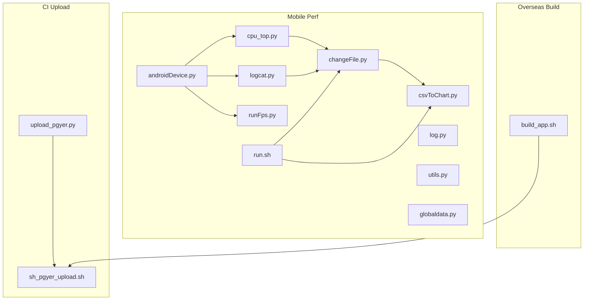
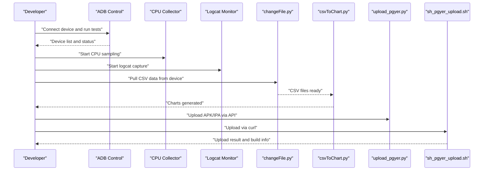
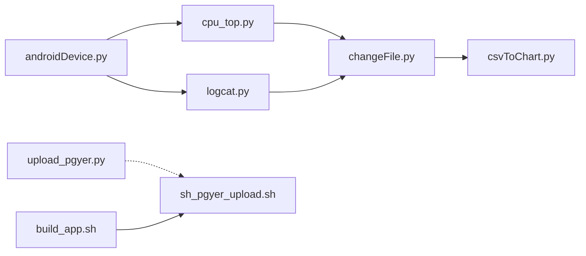

# Troubleshooting and Maintenance

<cite>
**Referenced Files in This Document**
- [README.md](file://README.md)
- [androidDevice.py](file://mobilePerf/perfCode/androidDevice.py)
- [log.py](file://mobilePerf/perfCode/common/log.py)
- [utils.py](file://mobilePerf/perfCode/common/utils.py)
- [globaldata.py](file://mobilePerf/perfCode/globaldata.py)
- [cpu_top.py](file://mobilePerf/perfCode/cpu_top.py)
- [logcat.py](file://mobilePerf/perfCode/logcat.py)
- [runFps.py](file://mobilePerf/perfCode/runFps.py)
- [changeFile.py](file://mobilePerf/tools/changeFile.py)
- [csvToChart.py](file://mobilePerf/tools/csvToChart.py)
- [run.sh](file://mobilePerf/run.sh)
- [openPerf.bat](file://mobilePerf/tools/openPerf.bat)
- [upload_pgyer.py](file://ciBuild/utils/upload_pgyer.py)
- [sh_pgyer_upload.sh](file://ciBuild/sh_pgyer_upload.sh)
- [build_app.sh](file://overseaBuild/build_app.sh)
</cite>

## Table of Contents
1. [Introduction](#introduction)
2. [Project Structure](#project-structure)
3. [Core Components](#core-components)
4. [Architecture Overview](#architecture-overview)
5. [Detailed Component Analysis](#detailed-component-analysis)
6. [Dependency Analysis](#dependency-analysis)
7. [Performance Considerations](#performance-considerations)
8. [Troubleshooting Guide](#troubleshooting-guide)
9. [Maintenance Procedures](#maintenance-procedures)
10. [Escalation and Support](#escalation-and-support)
11. [Conclusion](#conclusion)

## Introduction
This document provides comprehensive troubleshooting and maintenance guidance for the QA Performance Code project. It focuses on diagnosing and resolving common issues related to device connectivity, build and upload failures, and performance data collection. It also covers systematic debugging approaches, log analysis techniques, maintenance procedures (cleanup, updates, backups), performance optimization, and escalation resources.

## Project Structure
The project is organized into modules supporting:
- Device automation and performance data collection (mobilePerf/perfCode)
- Data ingestion and visualization (mobilePerf/tools)
- CI upload integrations (ciBuild)
- Overseas build orchestration (overseaBuild)
- Build utilities (appBuild)

**Diagram sources**
- [androidDevice.py](file://mobilePerf/perfCode/androidDevice.py)
- [cpu_top.py](file://mobilePerf/perfCode/cpu_top.py)
- [logcat.py](file://mobilePerf/perfCode/logcat.py)
- [runFps.py](file://mobilePerf/perfCode/runFps.py)
- [changeFile.py](file://mobilePerf/tools/changeFile.py)
- [csvToChart.py](file://mobilePerf/tools/csvToChart.py)
- [run.sh](file://mobilePerf/run.sh)
- [upload_pgyer.py](file://ciBuild/utils/upload_pgyer.py)
- [sh_pgyer_upload.sh](file://ciBuild/sh_pgyer_upload.sh)
- [build_app.sh](file://overseaBuild/build_app.sh)

**Section sources**
- [README.md](file://README.md)
- [run.sh](file://mobilePerf/run.sh)

## Core Components
- Device automation and ADB control: centralizes device detection, ADB lifecycle, logcat capture, and shell commands.
- Performance collectors: CPU sampling via top and FPS automation via swipe actions.
- Data ingestion and visualization: pulls performance CSVs from device storage and generates charts.
- CI upload utilities: Python and shell scripts to upload artifacts to a distribution service.
- Overseas build orchestrator: coordinates Android/iOS builds and notifications.

**Section sources**
- [androidDevice.py](file://mobilePerf/perfCode/androidDevice.py)
- [cpu_top.py](file://mobilePerf/perfCode/cpu_top.py)
- [logcat.py](file://mobilePerf/perfCode/logcat.py)
- [runFps.py](file://mobilePerf/perfCode/runFps.py)
- [changeFile.py](file://mobilePerf/tools/changeFile.py)
- [csvToChart.py](file://mobilePerf/tools/csvToChart.py)
- [upload_pgyer.py](file://ciBuild/utils/upload_pgyer.py)
- [sh_pgyer_upload.sh](file://ciBuild/sh_pgyer_upload.sh)
- [build_app.sh](file://overseaBuild/build_app.sh)

## Architecture Overview
The system integrates device automation, data collection, ingestion, and visualization. CI pipelines rely on upload utilities to publish builds.

**Diagram sources**
- [androidDevice.py](file://mobilePerf/perfCode/androidDevice.py)
- [cpu_top.py](file://mobilePerf/perfCode/cpu_top.py)
- [logcat.py](file://mobilePerf/perfCode/logcat.py)
- [changeFile.py](file://mobilePerf/tools/changeFile.py)
- [csvToChart.py](file://mobilePerf/tools/csvToChart.py)
- [upload_pgyer.py](file://ciBuild/utils/upload_pgyer.py)
- [sh_pgyer_upload.sh](file://ciBuild/sh_pgyer_upload.sh)

## Detailed Component Analysis

### Device Connectivity and ADB Management
Key responsibilities:
- Detect and validate device availability
- Manage ADB server lifecycle (start/kill/fork)
- Capture logcat streams and persist logs
- Execute shell commands with retries and timeouts
- Pull/push files and manage device storage

Common issues and diagnostics:
- ADB daemon not responding or port conflict
- Device offline or multiple devices detected
- Command execution failures or timeouts
- Insufficient storage or missing directories on device

Recommended checks:
- Verify ADB path resolution and environment variable usage
- Confirm single device selection when multiple devices present
- Review ADB server recovery and port conflict handling
- Validate device storage capacity and required directories

**Section sources**
- [androidDevice.py](file://mobilePerf/perfCode/androidDevice.py)

### CPU Data Collection
Key responsibilities:
- Poll CPU metrics via top/batch mode
- Aggregate per-process and device-wide CPU%
- Persist metrics to CSV and maintain top log rotation
- Handle SDK version differences in parsing

Common issues and diagnostics:
- Unsupported top flags causing immediate failure
- Empty or malformed top output leading to parsing errors
- Excessive CSV size impacting disk usage

Recommended checks:
- Validate top command compatibility and fallback to non-batch mode
- Monitor CSV file sizes and rotate/remove oversized files
- Confirm package names and PID resolution

**Section sources**
- [cpu_top.py](file://mobilePerf/perfCode/cpu_top.py)

### Logcat Monitoring and Crash Analysis
Key responsibilities:
- Start/stop logcat with buffer selection
- Real-time log processing and exception tagging
- Write exception stacks and launch time metrics to CSV

Common issues and diagnostics:
- Duplicate or missing logcat processes
- Regex parsing mismatches for launch time tags
- IO errors writing exception logs or stacks

Recommended checks:
- Ensure single logcat instance is running
- Validate exception tag lists and log line formats
- Confirm CSV write permissions and file existence

**Section sources**
- [logcat.py](file://mobilePerf/perfCode/logcat.py)

### Performance Data Ingestion and Visualization
Key responsibilities:
- Pull CSV files from device storage to host
- Normalize filenames and move to report folders
- Generate charts from CSV data

Common issues and diagnostics:
- Device not connected or Solopi path missing
- CSV encoding/format mismatch
- Matplotlib rendering errors

Recommended checks:
- Confirm device USB connection and Solopi installation
- Validate CSV encodings and column counts
- Ensure report directories exist and are writable

**Section sources**
- [changeFile.py](file://mobilePerf/tools/changeFile.py)
- [csvToChart.py](file://mobilePerf/tools/csvToChart.py)

### CI Upload Utilities
Two complementary upload mechanisms:
- Python script using requests to upload to a distribution service
- Shell script using curl to upload via tokenized endpoint

Common issues and diagnostics:
- Invalid API key or unsupported file extension
- Token retrieval failures or upload endpoint errors
- Build info polling timing out

Recommended checks:
- Verify API key validity and file type support
- Confirm network reachability and token presence
- Retry build info polling with backoff

**Section sources**
- [upload_pgyer.py](file://ciBuild/utils/upload_pgyer.py)
- [sh_pgyer_upload.sh](file://ciBuild/sh_pgyer_upload.sh)

### Overseas Build Orchestration
Coordinates Android/iOS builds, validates outputs, and sends notifications. Integrates with upload scripts.

Common issues and diagnostics:
- Missing build artifacts (APK/AAB/IPA)
- Git commit tracking inconsistencies
- Notification failures

Recommended checks:
- Validate build artifact paths and existence
- Confirm git log and commit ID files
- Ensure notification script availability

**Section sources**
- [build_app.sh](file://overseaBuild/build_app.sh)

## Dependency Analysis
Inter-module dependencies and coupling:
- androidDevice.py is foundational for CPU and Logcat modules
- CPU and Logcat depend on common utilities and logging
- changeFile.py depends on device connectivity and CSV normalization
- csvToChart.py depends on report directory structure and CSV formats
- CI upload utilities are independent but can be invoked by build orchestration

**Diagram sources**
- [androidDevice.py](file://mobilePerf/perfCode/androidDevice.py)
- [cpu_top.py](file://mobilePerf/perfCode/cpu_top.py)
- [logcat.py](file://mobilePerf/perfCode/logcat.py)
- [changeFile.py](file://mobilePerf/tools/changeFile.py)
- [csvToChart.py](file://mobilePerf/tools/csvToChart.py)
- [upload_pgyer.py](file://ciBuild/utils/upload_pgyer.py)
- [sh_pgyer_upload.sh](file://ciBuild/sh_pgyer_upload.sh)
- [build_app.sh](file://overseaBuild/build_app.sh)

**Section sources**
- [androidDevice.py](file://mobilePerf/perfCode/androidDevice.py)
- [cpu_top.py](file://mobilePerf/perfCode/cpu_top.py)
- [logcat.py](file://mobilePerf/perfCode/logcat.py)
- [changeFile.py](file://mobilePerf/tools/changeFile.py)
- [csvToChart.py](file://mobilePerf/tools/csvToChart.py)
- [upload_pgyer.py](file://ciBuild/utils/upload_pgyer.py)
- [sh_pgyer_upload.sh](file://ciBuild/sh_pgyer_upload.sh)
- [build_app.sh](file://overseaBuild/build_app.sh)

## Performance Considerations
- Reduce overhead by tuning collection intervals and avoiding excessive CSV writes
- Limit logcat buffer size and enable periodic rotation
- Minimize device I/O by batching pull operations
- Use appropriate chart generation parameters to avoid memory spikes
- Monitor disk usage on both host and device to prevent stalls

[No sources needed since this section provides general guidance]

## Troubleshooting Guide

### Device Connection Problems
Symptoms:
- “no devices/emulators found”
- “device not found”
- “offline”
- “more than one device”
- ADB server not responding or port conflict

Systematic approach:
- Verify ADB path resolution and environment variables
- Kill and restart ADB server; resolve port 5037 conflicts
- Select a single device when multiple devices are present
- Reconnect device and ensure USB debugging is enabled

Diagnostic references:
- ADB server recovery and port conflict handling
- Device listing and connection checks
- Timeout and error message handling

**Section sources**
- [androidDevice.py](file://mobilePerf/perfCode/androidDevice.py)

### Build Failures
Symptoms:
- Missing APK/AAB/IPA artifacts
- Git commit tracking issues
- Notification failures

Systematic approach:
- Validate build artifact paths and existence
- Confirm git log and commit ID files
- Ensure notification script availability and permissions

Diagnostic references:
- Build orchestration and artifact verification
- Commit ID persistence and change log generation

**Section sources**
- [build_app.sh](file://overseaBuild/build_app.sh)

### Upload Errors (Distribution Service)
Symptoms:
- Invalid API key or unsupported file type
- Token retrieval failures
- Upload endpoint errors
- Build info polling timeout

Systematic approach:
- Verify API key validity and file extension support
- Confirm network reachability and token presence
- Retry build info polling with backoff

Diagnostic references:
- Python upload flow and HTTP status handling
- Shell upload flow and curl command outputs

**Section sources**
- [upload_pgyer.py](file://ciBuild/utils/upload_pgyer.py)
- [sh_pgyer_upload.sh](file://ciBuild/sh_pgyer_upload.sh)

### Performance Data Collection Issues
Symptoms:
- Unsupported top flags
- Empty or malformed top output
- Excessive CSV size
- CSV encoding/format mismatch
- Matplotlib rendering errors

Systematic approach:
- Validate top command compatibility and fallback to non-batch mode
- Monitor CSV file sizes and rotate/remove oversized files
- Confirm CSV encodings and column counts
- Ensure report directories exist and are writable

Diagnostic references:
- CPU collector command handling and CSV persistence
- Data ingestion and CSV normalization
- Chart generation and plotting parameters

**Section sources**
- [cpu_top.py](file://mobilePerf/perfCode/cpu_top.py)
- [changeFile.py](file://mobilePerf/tools/changeFile.py)
- [csvToChart.py](file://mobilePerf/tools/csvToChart.py)

### FPS Automation Issues
Symptoms:
- Unable to detect device or package name
- Swiping commands failing or not executed

Systematic approach:
- Verify device connectivity and package activity presence
- Adjust swipe sequences and timing
- Ensure adb shell commands are properly formed

Diagnostic references:
- Device and package name detection
- Swipe automation and adb shell execution

**Section sources**
- [runFps.py](file://mobilePerf/perfCode/runFps.py)

### Logcat and Crash Analysis Issues
Symptoms:
- Duplicate or missing logcat processes
- Regex parsing mismatches for launch time tags
- IO errors writing exception logs or stacks

Systematic approach:
- Ensure single logcat instance is running
- Validate exception tag lists and log line formats
- Confirm CSV write permissions and file existence

Diagnostic references:
- Logcat lifecycle and buffering
- Exception handling and stack capture
- Launch time parsing and CSV writing

**Section sources**
- [logcat.py](file://mobilePerf/perfCode/logcat.py)

## Maintenance Procedures

### Log Management
- Enable timed rotation and retention policies
- Monitor log file sizes and prune old logs
- Centralize logs under a dedicated directory

References:
- Logging configuration and rotation

**Section sources**
- [log.py](file://mobilePerf/perfCode/common/log.py)

### Cleanup Operations
- Remove oversized CSV files during collection
- Clean up temporary directories after ingestion
- Rotate and archive reports periodically

References:
- CSV size checks and removal
- Report directory creation and file moves

**Section sources**
- [cpu_top.py](file://mobilePerf/perfCode/cpu_top.py)
- [changeFile.py](file://mobilePerf/tools/changeFile.py)

### Update Procedures
- Update ADB platform-tools if needed
- Upgrade Python dependencies for upload utilities
- Refresh device-specific parsing logic for new OS versions

References:
- ADB path resolution and platform-specific binaries
- Upload utility dependencies and API endpoints

**Section sources**
- [androidDevice.py](file://mobilePerf/perfCode/androidDevice.py)
- [upload_pgyer.py](file://ciBuild/utils/upload_pgyer.py)

### Backup Strategies
- Back up collected CSVs and generated charts regularly
- Preserve device-side performance data before device reuse
- Maintain commit ID and change log files for traceability

References:
- Report directory structure and file organization
- Build orchestration commit tracking

**Section sources**
- [changeFile.py](file://mobilePerf/tools/changeFile.py)
- [build_app.sh](file://overseaBuild/build_app.sh)

## Escalation and Support
- For device connectivity issues, escalate to platform-specific ADB troubleshooting and vendor support.
- For upload failures, escalate to distribution service support with API responses and timestamps.
- For build orchestration issues, escalate to CI administrators with build logs and artifact verification.
- For performance data discrepancies, escalate to device OEMs or Android performance tooling teams.

[No sources needed since this section provides general guidance]

## Conclusion
This guide consolidates actionable troubleshooting steps, maintenance routines, and escalation pathways for the QA Performance Code project. By following the structured diagnostics and operational procedures outlined here, teams can quickly isolate and resolve issues across device connectivity, build pipelines, uploads, and performance data collection.